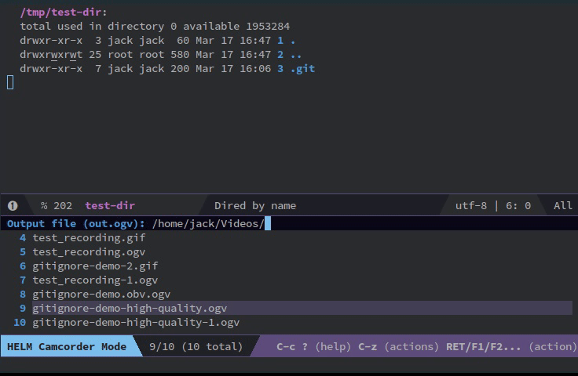

# gitignore.el

Automatically add .gitignore files to your projects in Emacs. 

Call `M-x gitignore-add-template`, choose a language, (e.g. `Emacs` or `Python`) and the corresponding .gitignore file will be added to your project's root.

If you already have a .gitignore file, the new ignore patterns will be appended to it.

## Magit

`gitignore.el` automatically integrates with Magit. Just require it. If you have Magit installed, it will prompt you for a gitignore when you create a new project.

## Method

GitHub has a set of boilerplate .gitignore templates at [https://github.com/github/gitignore](https://github.com/github/gitignore). This modules pulls that repo into a local cache, extracts the template names and prompts you to select one. The template is then copied over. 

You must have internet connection the first time you add a .gitignore (it needs to clone the repo), but after that it will work offline.
